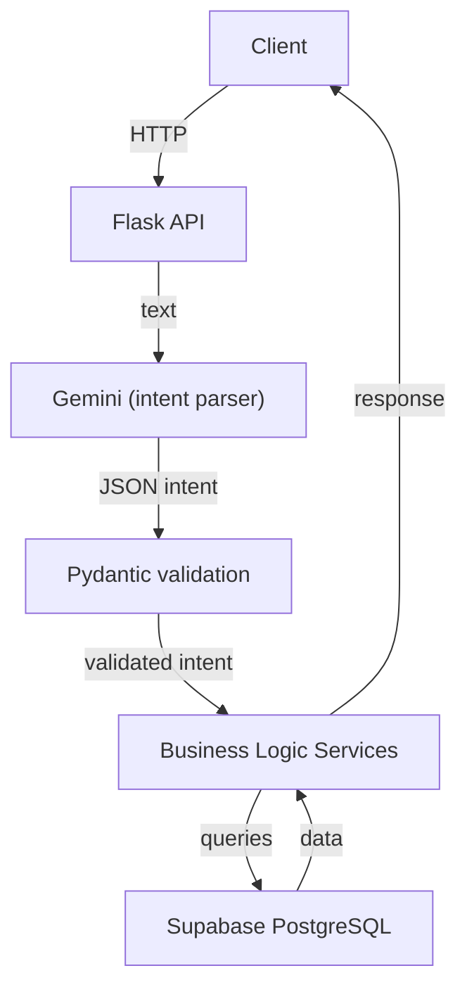

# ShopSense AI — Backend

A voice-first, context-aware shopping assistant backend. Accepts natural language commands in English, Hindi, and Hinglish and turns them into structured shopping operations.

---

## Architecture



**The LLM only parses text into intent — it never touches the database.**

---

## Tech Stack

| Layer | Technology |
|---|---|
| Runtime | Python 3.12 |
| Framework | Flask 3.x |
| Database | Supabase (PostgreSQL) |
| AI | Google Gemini (`google-genai`) |
| Validation | Pydantic v2 |
| Config | python-dotenv |
| Tests | pytest + pytest-flask |

---

## Folder Structure

```
backend/
├── app/
│   ├── __init__.py           # App factory
│   ├── config.py             # Env config + URL sanitization
│   ├── routes/
│   │   ├── health.py         # GET /api/health
│   │   ├── products.py       # GET /api/products
│   │   ├── shopping.py       # Shopping list CRUD
│   │   ├── voice.py          # POST /api/voice/command
│   │   ├── recommendations.py
│   │   ├── context.py
│   │   ├── history.py
│   │   └── basket.py
│   ├── services/
│   │   ├── supabase_service.py
│   │   ├── gemini_service.py
│   │   ├── intent_service.py
│   │   ├── product_service.py
│   │   ├── shopping_service.py
│   │   ├── history_service.py
│   │   ├── recommendation_service.py
│   │   ├── basket_service.py
│   │   └── context_service.py
│   ├── schemas/
│   │   ├── intent.py         # Pydantic intent schemas
│   │   ├── shopping.py       # Shopping request schemas
│   │   └── common.py         # Response helpers
│   └── utils/
│       └── errors.py         # Centralized error handling
├── tests/
│   ├── conftest.py
│   ├── test_health.py
│   ├── test_products.py
│   ├── test_intent.py
│   └── test_shopping.py
├── .env
├── .env.example
├── requirements.txt
└── run.py
```

---

## Environment Variables

Copy `.env.example` to `.env` and fill in:

```env
SUPABASE_URL=https://<project-id>.supabase.co
SUPABASE_KEY=your_supabase_anon_or_service_key
GEMINI_API_KEY=your_gemini_api_key
CORS_ORIGINS=http://localhost:3000
```

> **Important:** Do NOT append `/rest/v1/` to `SUPABASE_URL`. The Supabase client adds that automatically.

---

## Local Setup

```bash
cd backend
python -m venv venv
venv\Scripts\activate       # Windows
# source venv/bin/activate  # Mac/Linux
pip install -r requirements.txt
cp .env.example .env
# Edit .env with your credentials
python run.py
```

---

## API Endpoints

### Health
| Method | Path | Description |
|---|---|---|
| GET | `/api/health` | Database connectivity check |

### Products
| Method | Path | Description |
|---|---|---|
| GET | `/api/products` | List products (supports filters) |
| GET | `/api/products/<id>` | Get single product |
| GET | `/api/products/search?q=milk` | Search products |

**Product filters:** `search`, `category`, `brand`, `max_price`, `min_price`, `in_stock`

### Shopping Lists
| Method | Path | Description |
|---|---|---|
| POST | `/api/shopping-lists` | Create list |
| GET | `/api/shopping-lists/<id>` | Get list with items |
| DELETE | `/api/shopping-lists/<id>` | Delete list |
| POST | `/api/shopping-lists/<id>/items` | Add item |
| PATCH | `/api/shopping-items/<id>` | Update quantity / mark complete |
| DELETE | `/api/shopping-items/<id>` | Remove item |

### Voice Command
| Method | Path | Description |
|---|---|---|
| POST | `/api/voice/command` | Parse and execute natural language command |

### Recommendations, Context, History, Basket
| Method | Path |
|---|---|
| GET | `/api/recommendations/<user_id>` |
| POST/GET/DELETE | `/api/context` |
| POST/GET | `/api/history` |
| POST | `/api/basket/optimize` |

---

## Example Requests

### Voice command (Hinglish)
```http
POST /api/voice/command
Content-Type: application/json

{
  "text": "bhai 2 litre doodh add kar de",
  "list_id": "your-list-uuid",
  "user_id": "your-user-uuid"
}
```

Response:
```json
{
  "success": true,
  "message": "Added 2.0 litre of Milk to your list.",
  "data": {"added": [...], "not_found": []}
}
```

### Product search with filters
```http
GET /api/products?search=milk&max_price=100&brand=Amul
```

### Set shopping context
```json
{
  "text": "kal 5 friends aa rahe hain",
  "user_id": "abc"
}
```
→ stores `CREATE_CONTEXT` → party context → drives recommendations

### Basket optimization
```http
POST /api/basket/optimize
{"list_id": "...", "budget": 1500}
```

---

## Supported Voice Intents

| Intent | Example |
|---|---|
| `ADD_ITEM` | "2 litre doodh add karo" |
| `REMOVE_ITEM` | "milk hatao list se" |
| `UPDATE_QUANTITY` | "3 kg atta kar do" |
| `SEARCH_PRODUCT` | "organic apples 200 ke andar" |
| `SET_BUDGET` | "mera budget 1000 hai" |
| `SET_PREFERENCE` | "mujhe low-fat products chahiye" |
| `CREATE_CONTEXT` | "kal 5 log aa rahe hain" |
| `GET_RECOMMENDATIONS` | "kya lena chahiye?" |
| `OPTIMIZE_BASKET` | "budget 1500 se zyada nahi" |
| `SHOW_LIST` | "meri list dikhao" |
| `CLEAR_LIST` | "list saaf karo" |

---

## Testing

```bash
venv\Scripts\python.exe -m pytest tests/ -v
```

All 16 tests pass. Tests mock Supabase and Gemini — no real API calls required.

---

## Deployment Notes

- Use a WSGI server (Gunicorn) in production: `gunicorn "app:create_app()"` 
- Replace anon key with service role key for server-side operations
- Set `CORS_ORIGINS` to your production frontend URL
- Never commit `.env` to version control
